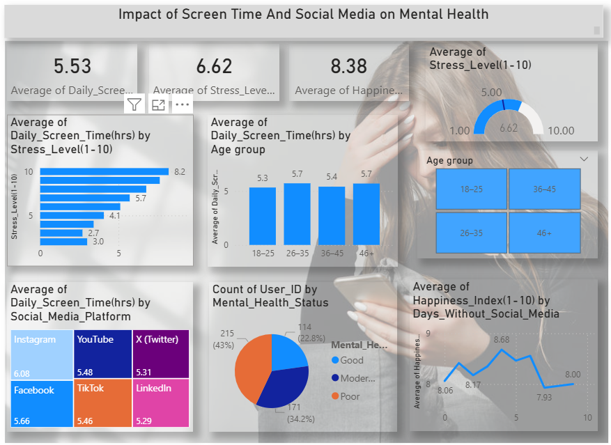

# Impact of Screen Time and Social Media on Mental Health

## Overview
This project presents an interactive Power BI dashboard analyzing the impact of screen time and social media usage on mental health. It focuses on identifying patterns and trends affecting stress, anxiety, and sleep quality.

## Objectives
- Analyze screen time behavior
- Understand the impact of social media usage
- Identify trends in mental health indicators
- Deliver insights through interactive visualization

## Tools & Technologies
- Power BI (Primary Tool)
- SQL (Data Preparation)

## Power BI Dashboard Features
- Screen Time Analysis (daily usage trends)
- Social Media Usage Insights
- Mental Health Metrics (stress, anxiety, sleep quality)
- Age Group Comparison
- Interactive filters and slicers for dynamic analysis

## Dataset
The dataset includes:
- Screen time (hours per day)
- Social media usage frequency
- Mental health indicators
- User demographics (age groups)
 ## 📊 Dashboard Preview  

## Key Insights
- Increased screen time is associated with higher stress levels
- Social media overuse impacts sleep quality negatively
- Younger age groups show higher engagement with digital platforms
- Interactive visuals help in identifying trends easily

## How to Use
1. Download the `.pbix` file
2. Open it in Power BI Desktop
3. Explore the dashboard using filters and visuals

 

## Author
Sakshi More
